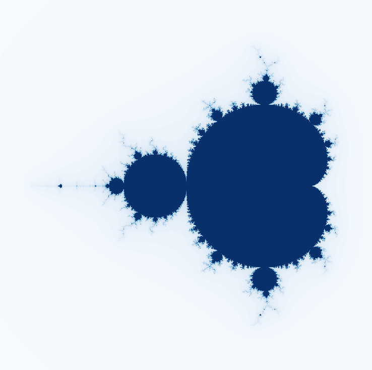

# Mandelbrot Set

## Table of contents
* [Overview](#overview)
* [Examples](#examples)
* [Technologies](#technologies)
* [Setup](#setup)
* [Limitations](#limitations)

## Overview
This program can generate and display the [Mandelbrot set](https://en.wikipedia.org/wiki/Mandelbrot_set "Wikipedia link")!

>  *"The Mandelbrot set is the set of complex numbers c for which the function f(z) = z^2+c does not diverge when iterated from z = 0"*

## Examples

> Screenshot of the generated Mandelbrot set

## Technologies
- **Python 3.8**
- **numpy 1.18**
  - For making the graphed set
- **matplotlib 3.2**
  - For displaying the graphed set

## Setup
To run this project, install the requirements and then run the program:

    pip3 install -r requirements
    python3 generate.py

# Limitations
- [ ] Only one colour scheme
- [ ] Cannot zoom into the mandelbrot set

## License
Licensed under the [MIT License](LICENSE)
